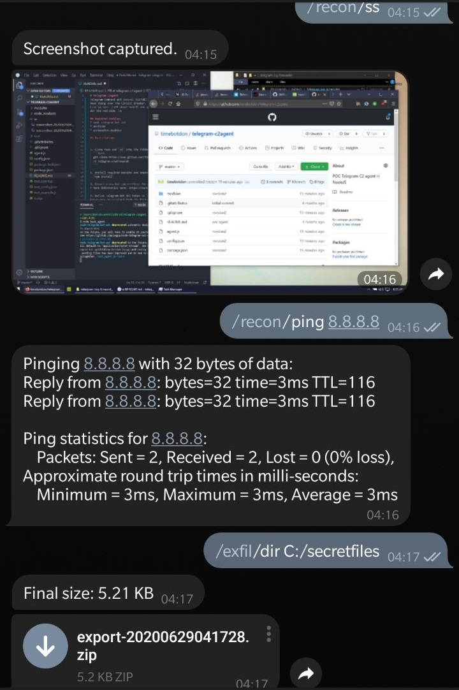
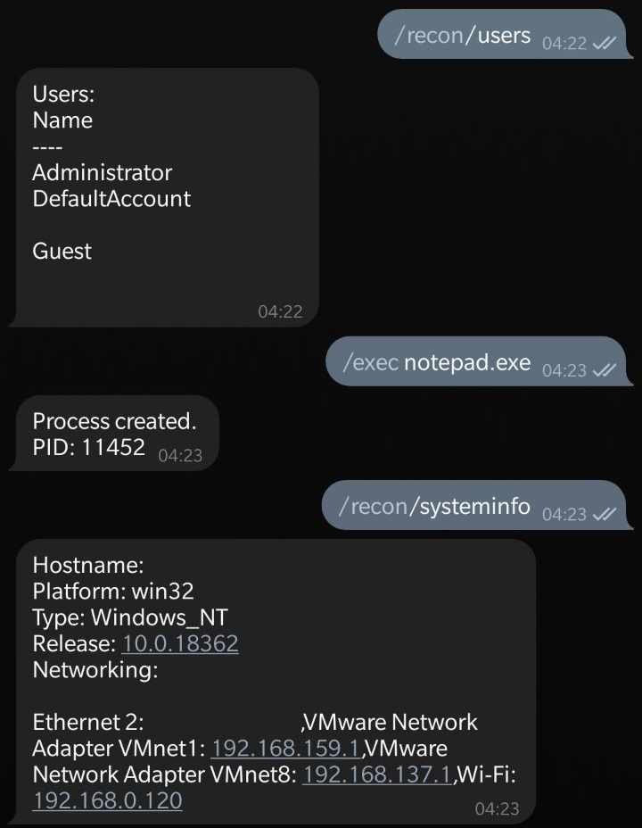

# telegram-c2agent
Telegram Command and Control (C2/C&C) Agent. Fun project I've been doing over the Circuit Breaker while learning more stuff
about nodeJS. Applying them this time for the red side!

## Previews
Some information is blocked out for obvious reasons.




## Required modules:
* node-telegram-bot-api
* archiver
* screenshot-desktop

## Installation:
1. Clone repo and `cd` into the folder:
  ```bash
  git clone https://www.github.com/timebotdon/telegram-c2agent
  cd telegram-c2agent
  ```

2. Install required modules and dependencies:
  `npm install`

3. Create a new bot and retrieve the API Token. 
* More information here: https://core.telegram.org/bots

4. Define Telegram Bot API token in `config.json`. The bot API token must be acquired from the Botfather bot.

5. Run script `node agent.js`.


## Agent Usage
Once the bot is setup, type `help` to get all commands and start playing!

### Reconnaissance
* `/recon/ping` - Ping IPv4 address
* `/recon/whoami` - User and workdir 
* `/recon/users` - Local user accounts
* `/recon/ss` - Grab desktop screenshot. (Note: Ensure that an "ss" subdir is already present to take a screenshot!)
* `/recon/systeminfo` - Get system information 

### Execute
* `/exec/head` - Run a command (head) 
* `/exec/headless` - Run a command (headless) 

### Exfiltrate
* `/exfil/dir` - Exfiltrate a directory 

### System
* `/system/lock` - Lock the system 

### Agent
* `/agent/pid` - Agent PID;

# Building (nexe)
There are no plans to build this project with `nexe` into a portable exe file (more info @ https://github.com/nexe/nexe)....yet.
You can if you want to!


Happy hacking!